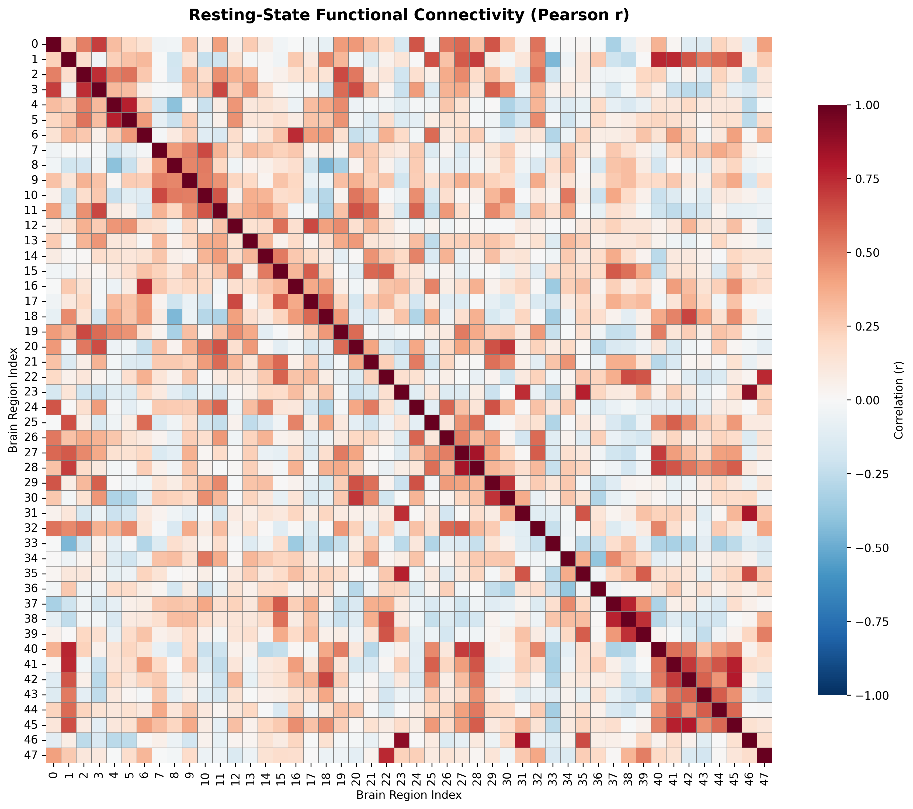
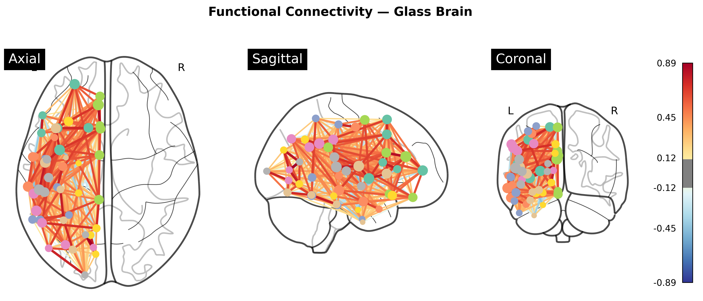
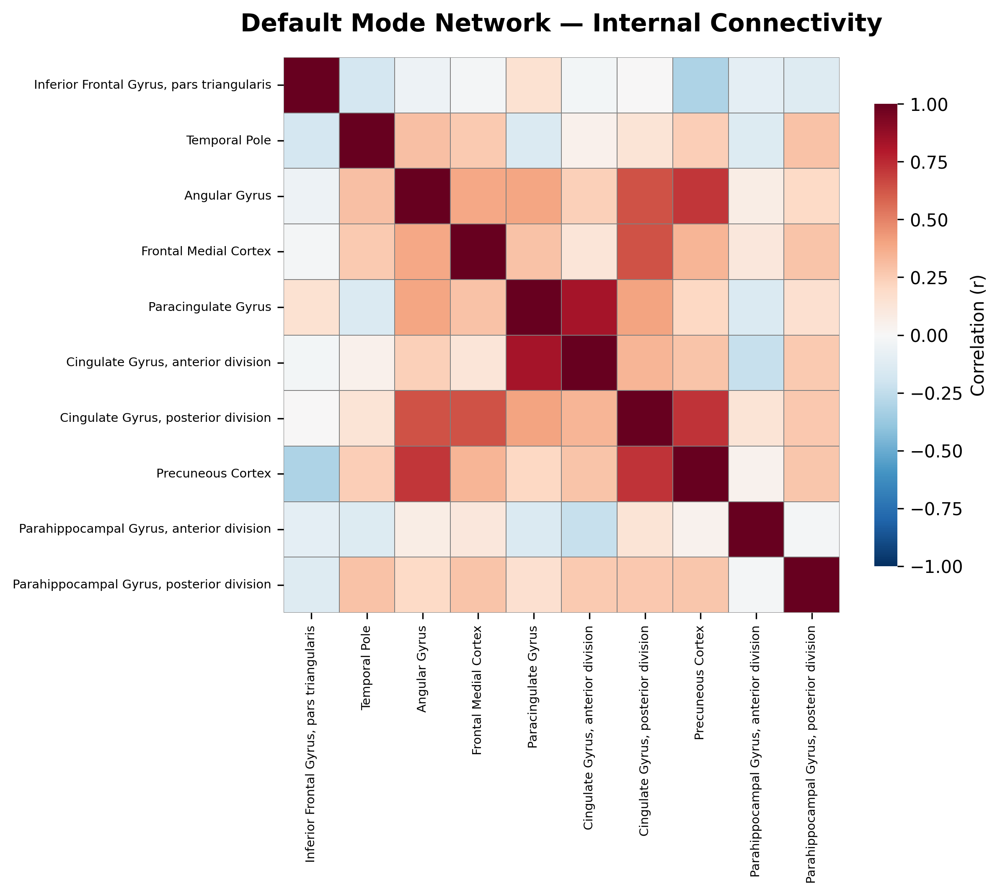

# fMRI Resting-State Connectivity Analyzer

A Python toolkit for analyzing resting-state fMRI data, computing functional connectivity matrices, and visualizing brain network organization using publicly available neuroimaging datasets.

## Overview

This project explores **functional connectivity** in the human brain at rest — identifying which brain regions synchronize their activity even when no specific task is being performed. By analyzing resting-state fMRI data with a standardized atlas, the toolkit computes correlation-based connectivity matrices and visualizes the underlying network structure.

## Features

- Automated data fetching from [Nilearn's](https://nilearn.github.io/) public datasets — no manual setup required
- Atlas-based parcellation using the Harvard-Oxford cortical/subcortical atlas (69 regions)
- Connectivity matrix computation via Pearson correlation or Ledoit-Wolf partial correlation
- Statistical thresholding with FDR (Benjamini-Hochberg) and Bonferroni correction
- Default Mode Network (DMN) extraction and visualization
- Glass brain plots, heatmaps, and chord diagrams for network visualization

## Sample Output

### Functional Connectivity Matrix


### Glass Brain Visualization


### Default Mode Network


## Installation

```bash
git clone https://github.com/cemondri/fMRI-Connectivity-Analyzer.git
cd fMRI-Connectivity-Analyzer
pip install -r requirements.txt
```
## Quick Start

The simplest way to run a complete analysis:

```bash
git clone https://github.com/cemondri/fMRI-Connectivity-Analyzer.git
cd fMRI-Connectivity-Analyzer
pip install -r requirements.txt
python main.py
```

This downloads sample resting-state fMRI data, computes the connectivity matrix, extracts the Default Mode Network, and saves four figures to `figures/`.

### Programmatic Usage

For more control, use the `ConnectivityAnalyzer` class directly:

```python
from src.connectivity import ConnectivityAnalyzer

analyzer = ConnectivityAnalyzer(atlas="harvard-oxford")
analyzer.fetch_data(n_subjects=1)
analyzer.extract_time_series()
conn_matrix = analyzer.compute_connectivity(method="correlation")

# Apply FDR thresholding
thresholded = analyzer.threshold_connections(method="fdr", alpha=0.05)

# Visualize
analyzer.plot_matrix(conn_matrix, threshold=0.3)
analyzer.plot_glass_brain(conn_matrix)
```

```

## Project Structure

```
fMRI-Connectivity-Analyzer/
├── src/
│   ├── __init__.py
│   ├── connectivity.py      # Core analysis engine
│   ├── preprocessing.py     # Signal cleaning utilities
│   └── visualization.py     # Plotting functions
├── notebooks/
│   └── 01_connectivity_analysis.ipynb
├── tests/
│   └── test_connectivity.py
├── figures/                  # Generated plots (auto-created)
├── requirements.txt
├── LICENSE
└── README.md
```

## Technical Details

| Parameter | Default Value |
|-----------|---------------|
| Atlas | Harvard-Oxford (48 cortical + 21 subcortical regions) |
| Bandpass filter | 0.01–0.1 Hz |
| Repetition time (TR) | 2.0 s |
| Connectivity measure | Pearson correlation, partial correlation (Ledoit-Wolf) |
| Significance correction | FDR (q < 0.05) or Bonferroni |
| Visualization | Nilearn glass brain, Matplotlib, Seaborn |

## Dependencies

- Python ≥ 3.9
- nilearn ≥ 0.10
- nibabel ≥ 5.0
- scikit-learn ≥ 1.3
- matplotlib ≥ 3.7
- seaborn ≥ 0.12
- numpy, scipy, pandas

## Future Work

- Graph-theoretic network metrics (modularity, betweenness centrality)
- Group-level comparisons (patient vs. control cohorts)
- Cross-modal integration with EEG source localization
- Interactive 3D brain viewer

## Related Projects

- [EEG-Signal-Analyzer-MATLAB](https://github.com/cemondri/EEG-Signal-Analyzer-MATLAB) — companion EEG processing toolkit

## License

MIT License — see [LICENSE](LICENSE) for details.
